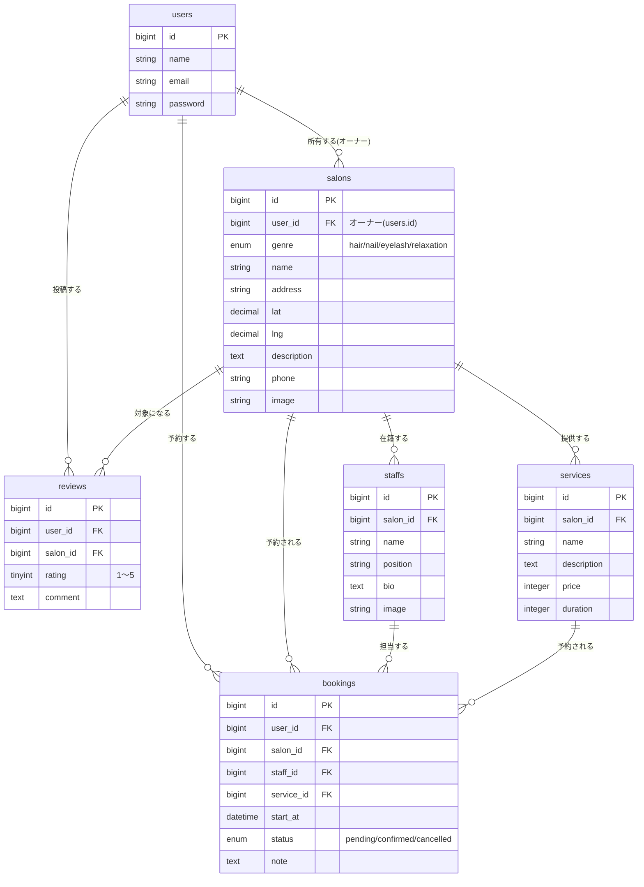

# Salon Booking System App

Hot Pepper Beautyのような、サロン（美容室・ネイル・まつげ・リラクゼーション）の検索・予約サイトです。個人学習用に開発しています。

---

## 実装した機能

### 一般ユーザー向け

- **トップページ / 検索**：エリア・サロン名のキーワード検索、ジャンル（ヘアサロン／ネイル／まつげ／リラクゼーション）での絞り込み
- **サロン一覧**：評価が高い順・現在地からの距離順での並び替え
- **サロン詳細**：写真、メニュー（料金・所要時間）、スタッフ紹介、地図（OpenStreetMap埋め込み）、口コミ一覧・投稿
- **予約フロー**：メニュー選択 → スタッフ選択 → 日時・備考入力 → 内容確認 の4ステップ、予約完了ページ
- **会員登録・ログイン**（Laravel Breeze）
- **マイページ**：直近の予約・投稿した口コミの表示、予約履歴一覧、予約のキャンセル

### サロンオーナー向け（管理者ダッシュボード）

- 自分のサロン情報の編集（名前・住所・電話番号・説明・画像・ジャンル・位置情報）
- スタッフの登録・編集・削除
- メニューの登録・編集・削除
- 予約の一覧確認・承認・キャンセル
- 他のオーナーのサロンを操作できないよう、全操作で所有者チェックを実施（IDOR対策）

---

## 使用技術

| 分類 | 技術 |
|---|---|
| バックエンド | Laravel 13 (PHP 8.4) |
| フロントエンド | React + TypeScript |
| Laravel⇔React連携 | Inertia.js（REST/GraphQL APIを別途叩くSPAではなく、コントローラーが直接Reactページを返す構成） |
| スタイリング | Tailwind CSS |
| 認証 | Laravel Breeze（Inertia + React版） |
| データベース | MySQL 8.0 |
| 開発環境 | Docker Compose（nginx / PHP-FPM / MySQL / phpMyAdmin） |

---

## ER図（テーブル構成）



---

## セットアップ方法（Docker）

### 1. 環境変数ファイルを用意する

```bash
cp .env.example .env
```

### 2. コンテナを起動する

```bash
docker compose up -d --build
```

初回はPHPのビルドに数分かかります。起動するコンテナは以下の4つです。

| サービス | 役割 | ポート |
|---|---|---|
| `nginx` | Webサーバー | http://localhost |
| `php` | Laravel本体（PHP-FPM） | - |
| `mysql` | データベース | 3306 |
| `phpmyadmin` | DB管理画面 | http://localhost:8080 |

### 3. アプリの初期設定をする

```bash
docker compose exec php composer install
docker compose exec php php artisan key:generate
docker compose exec php php artisan migrate --seed
```

### 4. フロントエンドをビルド（またはローカルで開発サーバー起動）

```bash
npm install
npm run dev    # 開発中はこちら（ホットリロード対応、ローカルで実行）
# または
npm run build  # 本番用ビルド
```

以後、`php artisan`系のコマンドは `docker compose exec php php artisan ○○` の形で実行してください（`.env`の`DB_HOST`がコンテナ内向けの設定になっているため、ホスト側で直接`php artisan serve`は使えません）。

---

## 動作確認用URL・テストアカウント

### URL

| ページ | URL |
|---|---|
| サロンを探す（トップページ） | http://localhost/salons |
| ログイン | http://localhost/login |
| 会員登録 | http://localhost/register |
| マイページ | http://localhost/dashboard |
| 管理者ダッシュボード（オーナーのみ） | http://localhost/owner/dashboard |
| phpMyAdmin | http://localhost:8080 |

### テストアカウント（`database/seeders/UserSeeder.php`で作成）

| メールアドレス | パスワード | 役割 |
|---|---|---|
| user@example.com | password | 一般ユーザー |
| user2@example.com | password | 一般ユーザー |
| owner@example.com | password | サロンオーナー |
| owner2@example.com | password | サロンオーナー（別サロン所有） |

> ⚠️ これらはローカル開発・確認用のダミーアカウントです。本番環境では絶対に使用しないでください。

---

## ディレクトリ構成（抜粋）

```
app/
  Http/Controllers/       … 一般ユーザー向けコントローラー
  Http/Controllers/Owner/ … オーナー管理画面向けコントローラー
  Models/                 … Eloquentモデル
database/
  migrations/             … テーブル定義
  seeders/                … 開発用ダミーデータ
resources/js/
  Pages/                  … 画面（Inertiaページ）
  Pages/Owner/            … オーナー管理画面
  Components/             … 共通UIパーツ
  Layouts/                … 共通レイアウト
docker/
  nginx/default.conf      … Webサーバー設定
  php/Dockerfile, php.ini … PHP実行環境
  mysql/my.cnf            … DB設定
```

---

## 今後の課題

- 口コミの編集・削除機能
- サーバー側でのキーワード検索（現状はブラウザ側でのフィルタリング）
- 予約のリマインドメール送信
